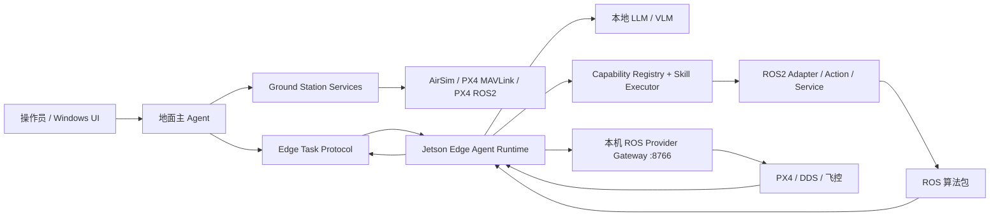

# UAV Agent 系统升级方案

> 状态：当前主线方案  
> 更新日期：2026-08-03  
> 适用范围：Windows 智能地面站、AirSim、PX4 MAVLink、PX4 ROS2、Jetson Orin Nano Super 8GB、后续真机

本文档是当前系统状态和后续升级优先级的唯一权威来源。其他设计文档负责解释某一专题；历史交接文档中的阶段编号和状态不再自动代表当前状态。

## 1. 总体目标

系统不是一个 AirSim 聊天控制 Demo，而是一个以 Windows 为操作中心的智能地面站：

```text
人工 UI / 地面主 Agent
  -> Ground Station Services
      -> Link / Vehicle / Telemetry / Mission / Command / Safety
          -> AirSim / PX4 MAVLink / PX4 ROS2 / Real Vehicle
```

在真机扩展阶段，增加边侧 Agent，但不替换现有地面 Agent：

```text
Windows 地面站
  -> 地面主 Agent：理解目标、全局规划、人工审批、多机协调
      -> Edge Task Protocol
          -> Jetson 边侧 Agent：本地感知、局部执行、有限重规划
              -> ROS Capability / Skill Adapter
                  -> ROS2 算法包 / PX4 ROS2 Gateway
```

核心原则：

- 现有 AirSim、PX4 MAVLink、PX4 ROS2 和真实飞控链路继续保留。
- LLM 只做任务级理解和决策，不进入飞控的高频控制环。
- UI 和 Agent 使用同一套 Ground Station 服务和 Mission 数据模型。
- Jetson 的边侧 Agent 是新增部署拓扑，不是替换现有飞控 Backend。
- 仿真优先：每一个边侧协议和 Agent 能力，都先在 WSL/虚拟机中验证，再部署到 Jetson。
- 高风险动作始终经过 Safety/Supervisor 和飞控 failsafe。

## 2. 当前系统基线

### 2.1 三条现有执行路径

| 路径 | 调用关系 | 主要用途 | 当前定位 |
|---|---|---|---|
| `airsim` | Windows Agent -> AirSim RPC | 飞行、相机、深度、搜索、跟踪和仿真感知 | 保持默认仿真主路径 |
| `px4_mavlink` | Windows Agent -> MAVLink UDP/TCP -> PX4 | PX4 SITL/飞控遥测、模式、命令和 Mission | 保留为 MAVLink 基线和诊断路径 |
| `px4_ros2` | Windows Agent -> HTTP :8766 -> ROS2 Gateway -> PX4 `/fmu/*` | PX4 ROS2、DDS、ROS Provider 和后续机载算法 | 保留，并作为 Jetson 边侧的底层控制路径 |

当前 `px4_ros2` 的 HTTP→ROS Gateway 必须保留。新增边侧路径时，变化的是调用者：

```text
现有直连模式：Windows Agent -> Jetson/WSL Gateway :8766
边侧模式：    Windows Agent -> Edge Agent :8780 -> 本机 Gateway :8766
```

### 2.2 已经具备的基础

根据当前代码、测试和脚本，系统已经具备以下基础：

- Backend Registry 和能力声明，能够区分 AirSim、PX4 MAVLink、PX4 ROS2。
- Tool cards、能力感知规划和 L0-L4 任务路由。
- Agent Runtime 的任务状态、事件、取消、暂停和人工审批状态。
- Ground Station Mission facade、`MissionPlanDraft` 和 Mission 相关 HTTP 接口。
- PX4 MAVLink 控制、遥测和 Mission Protocol 初版。
- ROS2 Gateway 的 PX4 状态、控制、障碍物 Provider、异步任务和 Offboard watchdog。
- AirSim 感知工具以及现有 `PerceptionHub`/检测相关代码。
- 面向 PX4 连接、Agent 执行、审批、Mission 和 ROS Gateway 的测试/验证脚本。

相关运行文档：[`ros_provider_bridge.md`](ros_provider_bridge.md)。

### 2.3 当前不能当作已经完成的内容

以下内容需要通过新的仿真验收矩阵重新确认，不能只根据历史交接文档中的“已完成”标记判断：

- PX4 Mission 的上传、启动、进度、取消和异常恢复的完整 SITL 闭环。
- AirSim、PX4 MAVLink 和 PX4 ROS2 在相同任务语义下的行为一致性。
- ROS2 第三方算法包的通用 Provider/Action/Service 适配。
- PX4 ROS2 路径下的图像、检测、深度、跟踪和规划能力。
- 主 Agent 与边侧 Agent 的父子任务、进度事件、抢占和断链恢复。
- Jetson 本地模型的内存、温度、功耗、推理延迟和 ROS 共存表现。
- 使用真实图像或录制数据验证多模态模型，而不是只验证接口返回。
- 真机前的地理围栏、Home 锁定、RC link、电池 failsafe 和硬件接管闭环。

## 3. 架构决策：Backend 与 Agent 拓扑分离

不要新增一个会复制飞控逻辑的“边侧飞控 Backend”。使用两个独立配置维度：

```yaml
execution_backend: airsim | px4_mavlink | px4_ros2 | real_vehicle
agent_topology: local | distributed_edge
```

典型组合：

| 场景 | `execution_backend` | `agent_topology` |
|---|---|---|
| 现有 AirSim 回归 | `airsim` | `local` |
| 现有 PX4 ROS2 回归 | `px4_ros2` | `local` |
| Jetson 上运行 PX4 SITL/DDS | `px4_ros2` | `distributed_edge` |
| 后期真机 | `px4_ros2` 或 `real_vehicle` | `distributed_edge` |

目标架构：



控制权边界：

```text
操作员接管 / 急停
  > PX4 硬件与 failsafe
  > Safety Supervisor
  > 边侧 Agent
  > 地面主 Agent
```

同一架飞行器在同一时间只能存在一个有效的控制租约。地面主 Agent 负责目标和约束，边侧 Agent 只能在租约范围内执行局部任务。

## 4. 仿真优先的开发拓扑

### 4.1 第一阶段：现有系统回归

```text
Windows
  -> AirSim / PX4 MAVLink / PX4 ROS2
```

目标是保证新增代码关闭时，现有 Agent 表现不变。应增加一个配置开关，而不是改变默认路径：

```yaml
agent_topology: local
edge_agent_enabled: false
```

### 4.2 第二阶段：Jetson 作为边侧仿真主机

```text
Windows AirSim / 地面站
  <-> 网络
Jetson PX4 SITL + uXRCE-DDS-Agent + ROS2
  ├── gateway_node :8766
  └── edge_agent :8780
```

AirSim 仍然在 Windows，Jetson 负责 PX4 SITL、DDS、ROS2、Edge Agent 和模型服务。需要单独规划 UDP 端口和 IP，避免 AirSim、PX4、MAVLink forwarding、WSL 和 Jetson 同时争用同一个端口。

### 4.3 第三阶段：Jetson Edge Agent 接入仿真图像

图像应使用独立的媒体/数据路径，不塞进控制协议：

```text
AirSim Camera / ROS Camera Topic / rosbag2
  -> Image Provider
      -> VLM 或检测模型
          -> 结构化 Observation
              -> Edge Agent Skill
```

AirSim 可以验证图像数据流、VLM 接口和任务工作流，但真实视觉泛化仍需使用录制的真实相机数据或 rosbag2 进行评估。

## 5. 边侧 Agent 的职责边界

边侧 Agent 不应是一个完整复制的地面主 Agent，而应是资源受限、工具受限的局部任务执行器。

它负责：

- 获取本地 ROS/PX4/传感器状态；
- 调用图像检测和 VLM；
- 执行 `search_area`、`track_target`、`capture_image` 等局部 Skill；
- 在障碍、目标丢失、局部规划失败时进行有限重规划；
- 向地面回报结构化事件和任务进度；
- 在短时断链内按安全策略继续、暂停或返航。

它不负责：

- 直接发布高频飞控 setpoint；
- 绕过 Gateway/Safety 调用 PX4；
- 任意启动、停止或重配置 ROS 包；
- 修改地面全局任务和多机编队分配；
- 用 VLM 输出直接替代飞行控制器。

## 6. ROS Provider 和 Skill 扩展方式

大模型看到的是稳定的语义能力，而不是原始 ROS 图：

```text
search_area()
plan_path()
detect_target()
track_target()
capture_image()
get_obstacle_summary()
```

每个能力必须声明：

```yaml
name: search_area
interface_type: ros_action
ros_name: /search_area
input_schema: {...}
output_schema: {...}
preconditions:
  - localization_valid
  - battery_above_threshold
cancel_supported: true
timeout_sec: 180
risk_level: medium
```

长任务使用 ROS2 Action，以获得 feedback、cancel 和 terminal result；短操作使用 Service；连续传感器数据使用 Topic，但先转换为摘要或结构化观测。

当前 `RosProviderBridgeClient` 已有 `capture`、`detect`、`depth`、`plan_path` 和 tracking 等接口雏形，但现有 Gateway 主要实现了 PX4 和 obstacle Provider。后续应补齐真正的 ROS2 Adapter，而不是让 Agent 直接访问原始 Topic。

## 7. 地面—边侧任务协议

每个地面任务应生成一个父任务，边侧生成子任务，ROS Action 再生成底层 goal：

```text
ground_run_id
  -> edge_task_id
      -> ros_goal_id
```

任务包至少包含：

```json
{
  "task_id": "edge_task_001",
  "parent_task_id": "ground_run_001",
  "vehicle_id": "uav01",
  "mission_version": 3,
  "goal": "search_and_capture",
  "constraints": {},
  "allowed_skills": [],
  "lease_id": "lease_001",
  "deadline_sec": 180
}
```

边侧事件至少包含：

```text
accepted
rejected
executing
paused
preempted
completed
failed
cancelled
```

地面 UI 显示结构化工作流：当前 Skill、ROS Action、进度、观测、错误和证据；不要求传输大模型内部思维文本。

第一版可以在现有 HTTP + SSE 基础上实现。后续需要补充：幂等键、序列号、任务版本、控制租约、心跳、超时、抢占和断链恢复。

## 8. Jetson 模型策略

Jetson Orin Nano Super 8GB 适合小型量化模型和按需多模态推理，不适合把大型通用模型持续放在飞控闭环中。

建议分层：

```text
常驻：小型文本 Agent / 规则规划器
常驻：YOLO、NanoOWL 或 TensorRT 检测器
按需：Qwen2.5-VL 3B、Gemma 3 4B 或同级 VLM
```

模型服务与 Agent Runtime 通过 OpenAI 兼容接口或稳定的本地 Provider 通信。模型应返回严格 JSON，由 Schema Validator、Safety Supervisor 和 Skill Executor 再决定是否执行。

模型评估指标：

- 首 token 延迟和完整响应延迟；
- 单帧图像推理延迟；
- CPU/GPU/内存峰值；
- 温度、功耗和持续运行稳定性；
- 工具选择准确率和参数错误率；
- 图像目标识别的 precision/recall；
- 模型不可用时的降级行为。

## 9. 当前面向仿真的主要提升点

### 9.1 Backend 一致性

同一个语义命令应在 AirSim、PX4 MAVLink 和 PX4 ROS2 下输出统一的任务状态和错误类型。需要建立 Backend conformance tests：

```text
connect -> get_status -> takeoff -> hover -> move -> land
```

每条路径都验证：参数、状态变化、超时、取消、错误码和最终状态。

### 9.2 Mission 闭环

需要把 Mission 从“可生成/可上传”推进到可复现验证：

```text
draft -> validate -> upload -> acknowledge -> start
  -> progress -> reached -> complete
```

同时验证上传失败、重复上传、任务取消、飞控重启、状态过期和坐标系错误。

### 9.3 ROS2 Provider 完整化

目前 ROS2 Gateway 的 PX4 控制和 obstacle 路径较清晰，但第三方算法包接入仍是 Provider 草图。优先实现三个仿真 Provider：

1. `image_source`：从 AirSim 或 ROS Camera 获取图像。
2. `detection_source`：接入现有检测节点并返回结构化目标。
3. `path_planner`：接入一个 ROS2 Action/Service，并返回受约束的路径候选。

### 9.4 Agent 工作流可观测性

目前地面 Runtime 已有事件和任务记录，但分布式模式还需要 parent/child task、边侧事件、ROS goal 和最终证据的统一关联。

### 9.5 故障注入

仿真阶段必须主动测试：

- Gateway 断开；
- PX4 heartbeat 过期；
- ROS Topic 过期；
- VLM 超时或输出非法 JSON；
- Action 无反馈；
- 任务取消发生在动作执行中；
- 地面重复下发同一任务；
- 边侧与地面 mission version 不一致。

### 9.6 图像和多模态验证

AirSim 图像适合验证接口和执行路径，但不能替代真实相机分布。应增加：

- AirSim 图像回归集；
- rosbag2 图像回放；
- 固定图像问题集；
- VLM JSON 输出验证；
- 视觉判断与飞行 Skill 之间的安全隔离。

## 10. 后续实施阶段

### P0：文档和基线收敛

交付：

- `docs/README.md` 作为导航；
- 本文作为唯一主线；
- 明确三条 Backend 和两种 Agent 拓扑；
- 现有仿真回归命令和测试矩阵。

验收：关闭新增功能后，AirSim 默认路径不变。

### P1：仿真 Backend 一致性

交付：

- AirSim/PX4 MAVLink/PX4 ROS2 共用的 command/result/error schema；
- connect/status/takeoff/hover/move/land conformance tests；
- Mission upload/start/progress SITL 验证。

验收：同一任务在三条路径下都有可比的结构化结果。

### P2：ROS2 Provider 最小闭环

交付：

- image_source；
- detection_source；
- path_planner；
- Action feedback/cancel/timeout；
- provider capability manifest。

验收：不接 LLM 时，规则 Skill 能完成“获取图像—检测—规划—返回结果”。

### P3：Edge Protocol 和仿真边侧

交付：

- `edge_agent` 健康检查和能力发现；
- task start/status/cancel；
- SSE/WebSocket 事件；
- parent/child task 关联；
- WSL 或 Jetson PX4 SITL 运行。

验收：地面 UI 能看到边侧任务完整状态，断链后有确定性策略。

### P4：Jetson 本地模型服务

交付：

- 固定 JetPack、ROS2、PX4、DDS 版本；
- 一个文本模型服务；
- 一个候选 VLM；
- jtop/tegrastats 资源记录；
- 模型超时、OOM 和服务重启策略。

验收：Jetson 在 ROS2/PX4 同时运行时可以稳定完成指定模型请求。

### P5：边侧文本 Agent

交付：

- 限制后的本地 Tool/Skill cards；
- ROS2 Action/Service adapter；
- 结构化输出和参数验证；
- 边侧局部任务状态机。

验收：地面下发“起飞—悬停—观察状态—返航”等任务，边侧可执行并回报完整事件。

### P6：边侧多模态 Agent

交付：

- 图像采样和 VLM Provider；
- AirSim/rosbag2/真实图像统一输入接口；
- 目标检测和 VLM 语义确认组合；
- 视觉结果与飞行控制隔离；
- 视觉回归集。

验收：VLM 只能产生结构化 Observation，不能直接发布飞行控制指令。

### P7：主 Agent—边侧 Agent 联动

交付：

- 地面任务拆分；
- 边侧任务下发和进度合并；
- UI 工作流时间线；
- 任务抢占、人工取消和恢复；
- mission version 和控制租约。

验收：地面主 Agent 能看到边侧 Skill、ROS Action、模型观测和最终证据。

### P8：真机前安全收敛

交付：

- mTLS/设备身份和命令鉴权；
- 地理围栏、Home 锁定、RC link、电池 failsafe；
- 真机 profile 和审批策略；
- 断链/模型不可用/ROS 崩溃时的返航策略；
- 人工接管测试。

验收：任何模型故障都不会绕过安全层直接产生不可控飞行行为。

## 11. 建议的近期开发顺序

近期不应先做“把大模型装到 Jetson 并让它直接飞”，而应按以下顺序：

1. 记录现有 AirSim、PX4 MAVLink、PX4 ROS2 的可复现启动和验证命令。
2. 为现有三条路径补充统一的 command/result/error 和 conformance tests。
3. 保留 `gateway_node :8766`，在其上增加明确的 ROS2 Provider adapter 边界。
4. 实现不带 LLM 的 `edge_agent :8780`，先在 WSL 和 Jetson 跑通任务协议。
5. 在 Jetson 上部署一个小型文本模型，验证资源和工具调用。
6. 接入图像 Provider，再接入 VLM，不改变现有 AirSim 感知工具。
7. 最后将地面主 Agent 切换到 `distributed_edge`，默认仍保持 `local`。

## 12. 完成标准

系统升级完成的标志不是“模型能输出 ROS 指令”，而是：

- 现有 AirSim Agent 行为没有回归；
- 三条执行路径可以用同一任务模型比较和验证；
- Jetson 边侧 Agent 可以独立执行受限任务；
- 地面主 Agent 能看到边侧工作流和结构化证据；
- ROS 算法包通过 Adapter/Provider 接入，而不是被 LLM 任意调用；
- VLM 只输出观测和判断，不直接控制飞控；
- 网络、模型、ROS 和 PX4 故障都有明确的停止、悬停、返航或人工接管策略。
